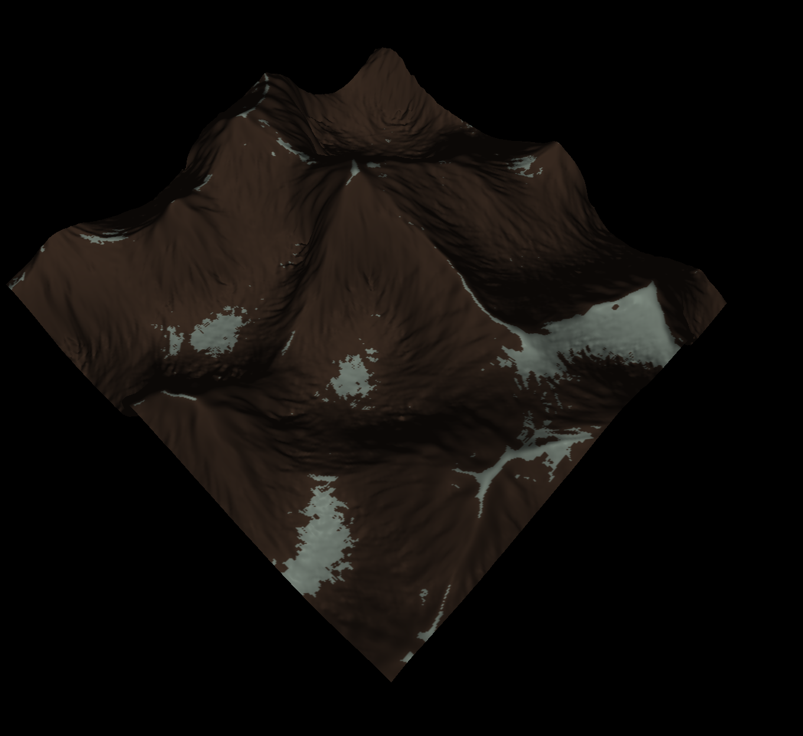

# heightMapper
The goal of this project was a simple heightmapper that would generate a plane, and given a heightmap, the vertices would displace accordingly on the y-axis. I got a little distracted and implemented a heightmap generation based on Perlin noise. Then I got a little distracted again and implemented a particle-based hydraulic erosion simulation on the Perlin values.

## Implementation
The implementation is based on Hans Theobald Beyer's work. Essentially, a random droplet is dropped in each iteration randomly on the plane. If the sediment carried by the droplet exceeds a certain capacity, a percentage of the sediment is deposited on the terrain, aka adding to the heightmap, or if the droplet is moving uphill. Otherwise, it is eroded, meaning subtracted from the heightmap. I have the paper referenced at the end of the README for a more detailed explaination. As for the colors, they are based on how similar a vertex is to its surrounding vertices. If they are similar enough, then that particular vertex is considered "snowy"; otherwise, it is "rocky".

## Dependencies
GLEW, GLFW, OpenGL, fastNoise, ImGui, glm

## How To Compile and Run
- Make a directory called build-dir 
- Get into the directory
- Compile using cmake
- Execute
```
mkdir build-dir
cd build-dir
cmake ..
./heightMapper
```

## Some Examples
<p align="center">
  
   
</p>
<p align="center">
  
  
</p>

## References
https://www.firespark.de/resources/downloads/implementation%20of%20a%20methode%20for%20hydraulic%20erosion.pdf
